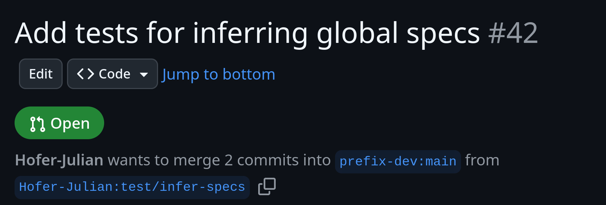

import { Tabs, TabItem, Steps, Card } from '@astrojs/starlight/components';

When I set the goal for myself to contribute to open source back in 2018,
I mostly struggled with two technical challenges:
- Python virtual environments, and
- Git together with GitHub.

Solving the former is nowadays my [job](https://prefix.dev/),
so let me write up my current workflow for the latter.

{/* excerpt */}

Most people use Git in combination with modern Git forges like GitHub and GitLab.
Git doesn't know anything about these forges, which is why CLI tools exist to close that gap.
It's still good to know how to handle things without them, so I will also explain how to do things with only Git.
For GitHub there's [`gh`](https://cli.github.com/) and for GitLab there's [`glab`](https://docs.gitlab.com/editor_extensions/gitlab_cli/).
Both of them are Go binaries without any dependencies that work on Linux, macOS and Windows.
If you don't like any of the provided installation methods, you can simply download the binary, make it executable and put it in your `PATH`.

Luckily, they also have mostly the same command line interface.
First, you have to login with the command that corresponds to your git forge:


<Tabs syncKey="forge">
  <TabItem label="GitHub">
    ```shell
    gh auth login
    ```
  </TabItem>
  <TabItem label="GitLab">
    ```shell
    glab auth login
    ```
  </TabItem>
</Tabs>

In the case of `gh` this even authenticates Git with GitHub.
With GitLab, you still have to set up authentication via [SSH](https://docs.gitlab.com/user/ssh/).

## Working Solo

The simplest way to use Git is to use it like a backup system.
First, you create a new repository on either [Github](https://docs.github.com/en/repositories/creating-and-managing-repositories/creating-a-new-repository) or [GitLab](https://docs.gitlab.com/user/project/).
Then you clone the repository:

```shell
git clone <REPO>
```

From that point on, all you have to do is:
- do some work
- commit
- push
- repeat

On its own there aren't a lot of reasons to choose this approach over a file syncing service like [Nextcloud](https://nextcloud.com/sign-up/).
No, the main reason you do this, is because you are either already familiar with the git workflow, or want to get used to it.

## Contributing

Git truly shines as soon as you start collaborating with others.
On a high level this works like this:

- You modify some files in a Git repository,
- you propose your changes via the Git forge,
- maintainers of the repository review your changes, and
- as soon as they are happy with your changes, they will integrate your changes into the main branch of the repository.

### Starting Out With a Fresh Branch

Let's go over the exact commands.

<Steps>

1. You will want to start out with the latest upstream changes in the default branch.
You can find out its name by running the following command:

    ```shell
    git ls-remote --symref origin HEAD
    ```

2. Chances are it displays either `ref/heads/main` or `refs/heads/master`.
The last component is the branch, so the default branch will be called either `main` or `master`.
Before you start a new branch, you will run the following two commands to make sure you start with the latest state of the repository:

    ```shell
    git switch <DEFAULT-BRANCH>
    git pull
    ```

3. You switch and create a new branch with:

    ```shell
    git switch --create <BRANCH>
    ```

    That way you can work on multiple features at the same time and easily keep your default branch synchronized with the remote repository.

</Steps>

### Open a Pull Request

The next step is to open a pull request on GitHub or merge request on GitLab.
Even though they are named differently, they are exactly the same thing.
Therefore, I will call both of them pull requests from now on.
The idea of a pull request is to integrate the changes from one branch into another branch (typically the default branch).
However, you don't necessarily want to give every potential contributor the power to create new branches on your repository.
That is why the concept of forks exists.
Forks are copies of a repository that are hosted on the same Git forge.
Contributors can now create branches on their own forks and open pull requests based on these branches.

<Steps>
1. If you don't have push access to the repository, now it's time to create your own fork.
    <Tabs syncKey="with-without">
      <TabItem label="With Forge Tools">
        With the Git forge tools, you only need a single command to both fork the repository and set up the git remotes.
        <Tabs syncKey="forge">
            <TabItem label="GitHub">

                ```shell
                gh repo fork --remote
                ```

                I don't know why `gh repo fork` doesn't set that for you,
                but now we need to tell `gh` which repository is the default.
                That way it knows against which repository you want to extend when opening a pull request.
                We want to extend the original repository, so let's select that with the interactive picker.

                ```shell
                gh repo set-default
                ```
            </TabItem>
            <TabItem label="GitLab">
            ```shell
            glab repo fork --remote
            ```
            </TabItem>
        </Tabs>
      </TabItem>
      <TabItem label="Without Forge Tools">
        Without the forge CLI tools, you first fork the repository in the web interface.

        Then, you run the following commands:

        ```shell
        git remote rename origin upstream
        git remote add origin <FORK>
        ```

        When you cloned your repository, Git set the default branch of the original repo as the upstream branch for your local default branch.
        This is preserved by the remote rename, which is why the default branch can still be updated from upstream with `git pull` and no additional arguments.
      </TabItem>
    </Tabs>

3. Then, you open the Pull Request

    <Tabs syncKey="with-without">
      <TabItem label="With Forge Tools">
        `pr create` directly pushes and sets up your branch, and then opens the pull request for you.
        If you have a fork available, it will ask whether you want to push your branch there:

        <Tabs syncKey="forge">
          <TabItem label="GitHub">
            ```shell
            gh pr create
            ```
          </TabItem>
          <TabItem label="GitLab">
            ```shell
            glab mr create
            ```
          </TabItem>
        </Tabs>
      </TabItem>
      <TabItem label="Without Forge Tools">
        With Git, you first have to tell it that it should create the corresponding branch on the remote and set it as upstream branch.

        ```shell
        git push --set-upstream origin <BRANCH>
        ```

        Next, you open the repository in the web interface, where it will suggest opening a pull request.
        The upstream branch of your local branch is now configured, which means you can update your remote by running `git push` without any additional arguments.
      </TabItem>
    </Tabs>
</Steps>


## Checking out Pull Requests

Often, you want to check out a pull request on your own machine to verify that it works as expected.

<Tabs syncKey="with-without">
  <TabItem label="With Forge Tools">
    <Card>
      First you check out which pull requests are available

      <Tabs syncKey="forge">
        <TabItem label="GitHub">
          ```shell
          gh pr list
          ```
        </TabItem>
        <TabItem label="GitLab">
          ```shell
          glab mr list
          ```
        </TabItem>
      </Tabs>

      You remember the ID and use it to check out the pull request.

      <Tabs syncKey="forge">
        <TabItem label="GitHub">
          ```shell
          gh pr checkout <PR_ID>
          ```
        </TabItem>
        <TabItem label="GitLab">
          ```shell
          glab mr checkout <MR_ID>
          ```
        </TabItem>
      </Tabs>

      This works no matter if the pull request is coming from the repo itself or a fork, and it doesn't set up any additional remotes.

      You can check out the status of your pull request with `pr view`.
      By adding `--web`, it will directly open the web browser for you:

      <Tabs syncKey="forge">
        <TabItem label="GitHub">
          ```shell
          gh pr view --web
          ```
        </TabItem>
        <TabItem label="GitLab">
          ```shell
          glab mr view --web
          ```
        </TabItem>
      </Tabs>

    </Card>
  </TabItem>
  <TabItem label="Without Forge Tools">
    <Card>
      Checking out a pull request is surprisingly involved with Git alone.
      First, navigate to the pull request in your web browser.

      <Tabs>
        <TabItem label="Fork">
          In this example, can see that the pull request proposes changes from the repository by `Hofer-Julian` to a repository by `prefix-dev`.
          If the both branches are on the same repository, click on the tab "Same Repository" above.
          
          
          If the pull request comes from a fork, you execute the following commands:

          ```shell
          # Add a remote for the user who opened the pull request
          git remote add <USER> <FORK_OF_USER>
          # Fetch their repo
          git fetch <USER>
          # Check out their branch
          git switch <BRANCH>
          ```

        </TabItem>
        <TabItem label="Same Repository">
          In this example, can see that the pull request proposes changes from the repository by `Hofer-Julian` to a repository by `prefix-dev`.
          If the branches are on the different repositories, click on the tab "Fork" above.
          

          If it's the same repository, you run checkout the pull request like this:

          ```shell
          git fetch origin
          git switch <BRANCH>
          ```

        </TabItem>
      </Tabs>    
    </Card>
  </TabItem>
</Tabs>


## Conclusion

When I first heard of `gh`'s predecessor `hub`, I thought this is merely a tool for people who insist on doing everything in the terminal.
I only realized relatively recently that Git forge tools are in fact the missing piece to an efficient Git workflow.
Hopefully, you now have a better idea of the appeal of these tools!

*Many thanks to [Sabrina](https://github.com/M-Sabrina) and [Lucas](https://github.com/lucascolley) for their comments and suggestions on this article*

You can find the discussion at this Mastodon [post](https://chaos.social/@ju/114966203312328797).
